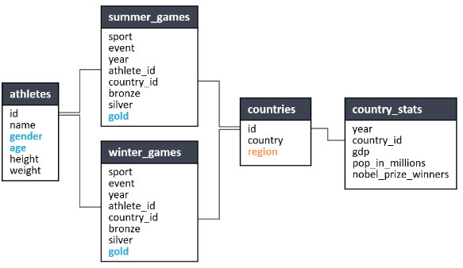
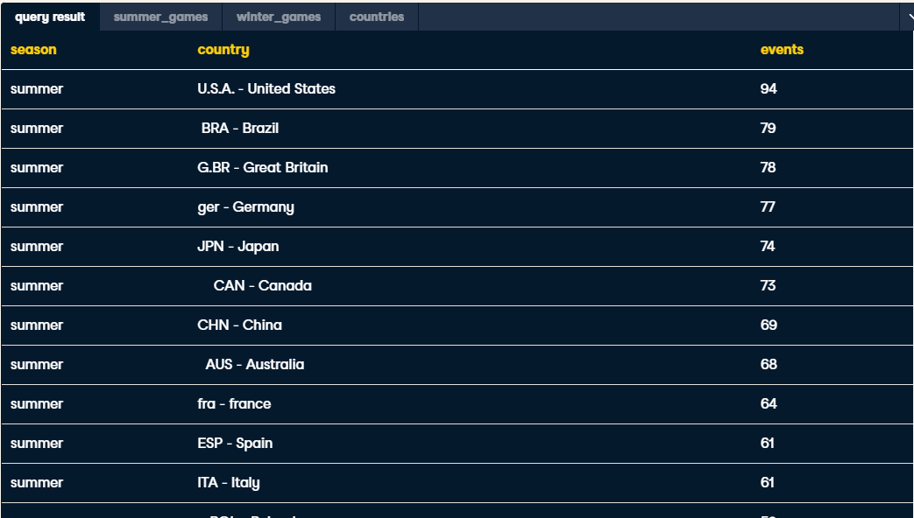
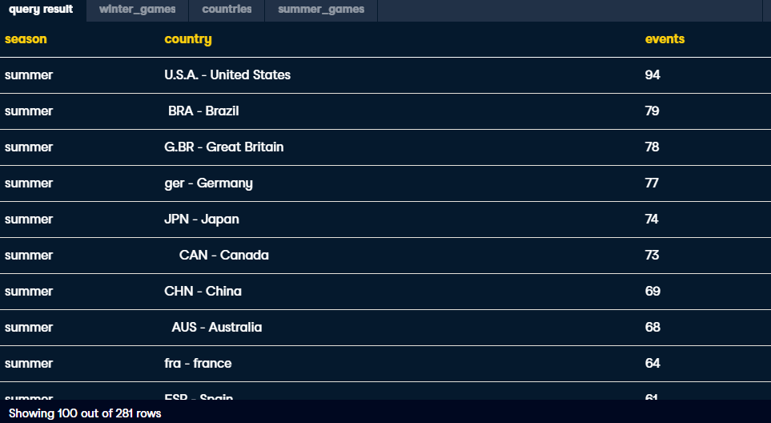
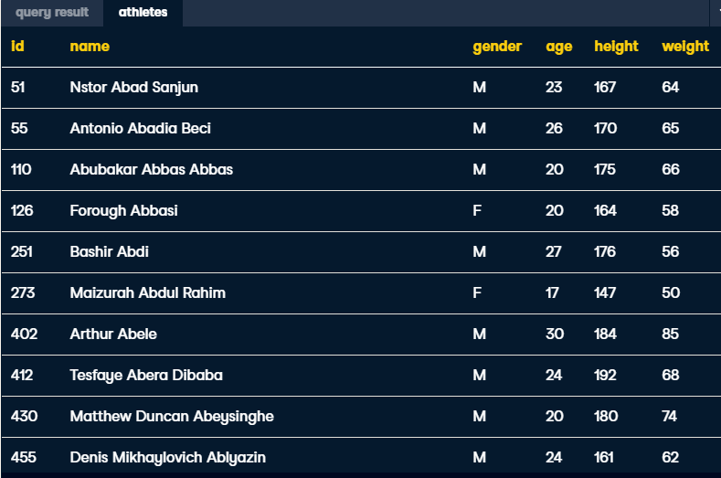
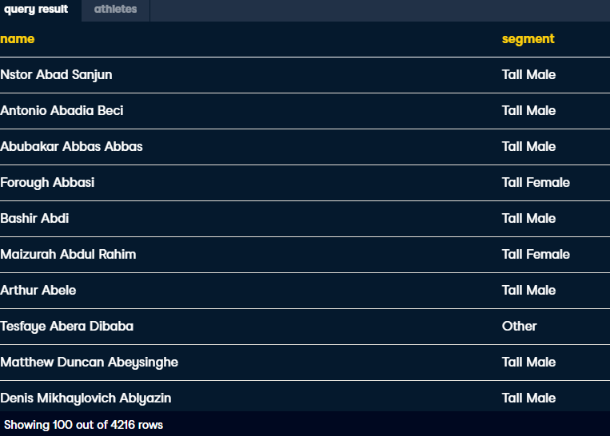
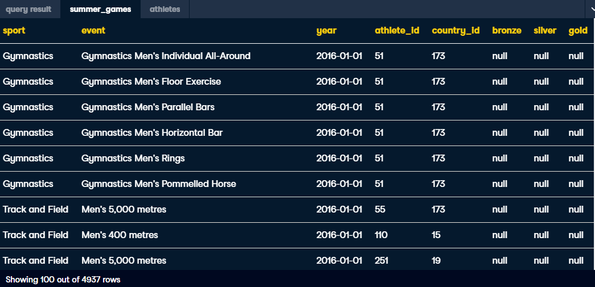
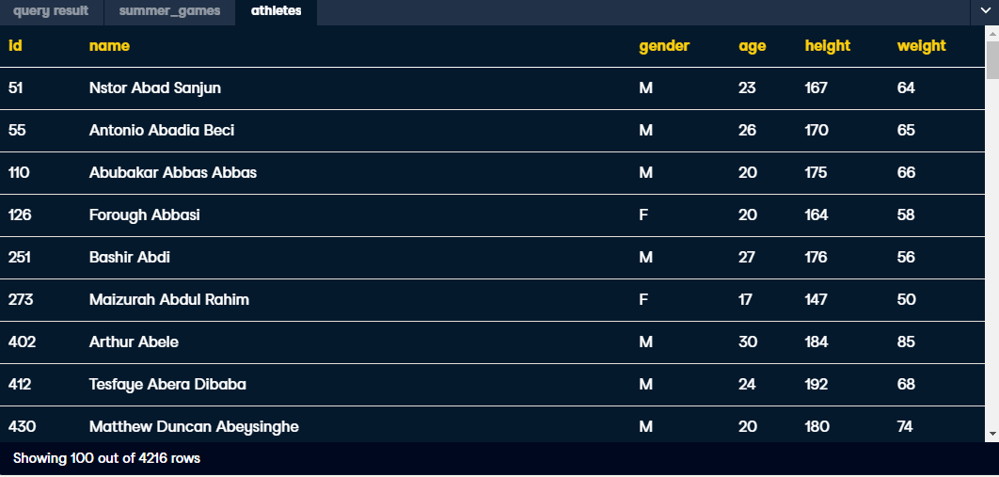
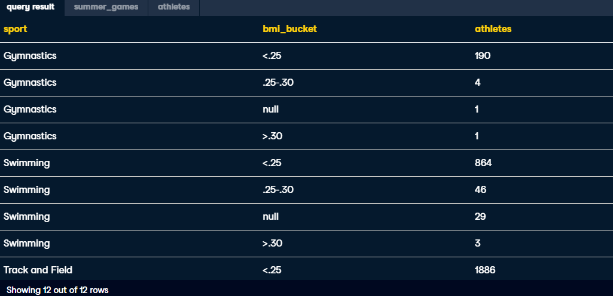
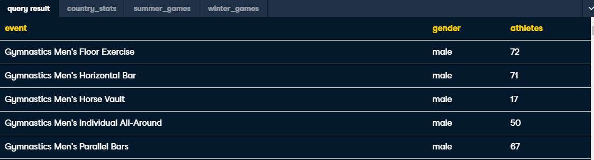

# SQL


### UNION ALL/JOIN



```sql
-- Query season, country, and events for all summer events
SELECT 
	'summer' AS season, 
    country, 
    COUNT(DISTINCT event) AS events
FROM summer_games AS s
JOIN countries AS c
ON s.country_id = c.id
GROUP BY country
-- Combine the queries
UNION ALL
-- Query season, country, and events for all winter events
SELECT 
	'winter' AS season, 
    country, 
    COUNT(DISTINCT event) AS events
FROM winter_games AS w
JOIN countries AS c
ON w.country_id = c.id
GROUP BY country
-- Sort the results to show most events at the top
ORDER BY events DESC;
```



## Sub Queries

```sql
-- Add outer layer to pull season, country and unique events
SELECT 
	season, 
    country, 
    COUNT(DISTINCT event) AS events
FROM
    -- Pull season, country_id, and event for both seasons
    (SELECT 
     	'summer' AS season, 
     	country_id, 
     	event
    FROM summer_games
    UNION ALL
    SELECT 
     	'winter' AS season, 
     	country_id, 
     	event
    FROM winter_games) AS subquery
JOIN countries AS c
ON subquery.country_id = c.id
-- Group by any unaggregated fields
GROUP BY season, country
-- Order to show most events at the top
ORDER BY events DESC;
```




## CASE 



```sql
SELECT 
	name,
    -- Output 'Tall Female', 'Tall Male', or 'Other'
	CASE when gender = 'F' and height >= 175 then 'Tall Female'
    when gender = 'M' and height >= 190 then 'Tall Male'
    else 'Other' END AS segment
FROM athletes;
```



## CASE 2	


```sql
-- Pull in sport, bmi_bucket, and athletes
SELECT 
	sport,
    -- Bucket BMI in three groups: <.25, .25-.30, and >.30	
    CASE WHEN 100*weight/height^2 <.25 THEN '<.25'
    WHEN 100*weight/height^2 <=.30 THEN '.25-.30'
    WHEN 100*weight/height^2 >.30 THEN '>.30' END AS bmi_bucket,
    COUNT(DISTINCT athlete_id) AS athletes
FROM summer_games AS s
JOIN athletes AS a
ON s.athlete_id = a.id
-- GROUP BY non-aggregated fields
GROUP BY sport, bmi_bucket
-- Sort by sport and then by athletes in descending order
ORDER BY sport, athletes DESC;
```


## IN 
```sql
-- Pull summer bronze_medals, silver_medals, and gold_medals
SELECT 
	sum(bronze) as bronze_medals, 
    sum(silver) as silver_medals,
    sum(gold) as gold_medals
FROM summer_games
-- Add the WHERE statement below
WHERE athlete_id IN
    -- Create subquery list for athlete_ids age 16 or below    
    (SELECT id
     FROM athletes
     WHERE age <= 16);
```


## LIKE

```sql
-- Pull event and unique athletes from summer_games 
SELECT 
	event, 
    -- Add the gender field below
    CASE when event LIKE '%Men%' then 'male'
    ELSE 'female' END AS gender,
    COUNT(DISTINCT athlete_id) AS athletes
FROM summer_games
GROUP BY event;
```


## Annexe

### Create table if not exists

### Delete column
```sql
ALTER TABLE table_name
DROP COLUMN column_name;
```

### Rename
```sql
ALTER TABLE table_name
RENAME COLUMN old_name TO new_name;
```

### Insert
```sql
INSERT INTO table VALUES ('valeur 1', 'valeur 2', ...)
```

```sql
INSERT INTO players
SELECT DISTINCT firstname, lastname, name_club
FROM club_players;
```
```sql
INSERT INTO table (nom_colonne_1, nom_colonne_2, ...
 VALUES ('valeur 1', 'valeur 2', ...)
```

```sql
INSERT INTO client (prenom, nom, ville, age)
 VALUES
 ('Rébecca', 'Armand', 'Saint-Didier-des-Bois', 24),
 ('Aimée', 'Hebert', 'Marigny-le-Châtel', 36),
 ('Marielle', 'Ribeiro', 'Maillères', 27),
 ('Hilaire', 'Savary', 'Conie-Molitard', 58);
```
### Delete table
```sql
DROP TABLE table_name where condition;
```
### Update

```
UPDATE table
SET nom_colonne_1 = 'nouvelle valeur'
WHERE condition
```
### INNER JOIN REJECT 

```sql
SELECT A2.* FROM TableA A2 
             WHERE A2.my_id NOT IN 
                       (Select tableA.my_id FROM 
                                     tableA 
                                     inner join 
                                     tableB 
                                     on tableA.my_id = tableB.my_id)
```


